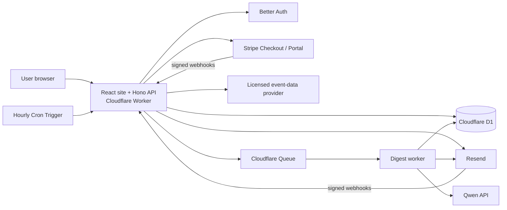
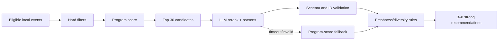

# Front Row Commercial V1 Architecture

Status: deferred reference architecture; the immediate plan is the smaller [Milestone 0 personal pilot](milestone-0.md)

Last reviewed: 2026-09-19

Scope: US-only weekly concert discovery, 90-day event window, paid subscription

## 1. Executive decision

Front Row should begin as a **serverless modular monolith**, not as a traditional always-on server and not as a collection of microservices.

The recommended production stack is:

| Concern | Decision |
| --- | --- |
| Web application | React + TypeScript, built with Vite |
| API | Hono + TypeScript in one Cloudflare Worker |
| Hosting and scheduled work | Cloudflare Workers Paid |
| Relational database | Cloudflare D1 with Drizzle migrations |
| Reliable background jobs | Cloudflare Queues, with a dead-letter queue |
| Authentication | Better Auth passwordless magic links, delivered by Resend |
| Event source | Contract-approved provider adapter; Ticketmaster feed preferred if approved |
| Recommendation | Deterministic candidate scoring, then optional Qwen reranking |
| Email | Resend with a dedicated sending subdomain |
| Payments | Stripe-hosted Checkout and Customer Portal |
| Monitoring | Structured logs, `job_runs` records, provider dashboards, and error alerts |

This keeps the fixed infrastructure cost low, removes server patching and capacity planning, and still gives the product a clean path to thousands of subscribers. Cloudflare Workers Paid currently starts at $5/month and includes sufficient Workers and D1 usage for an early product ([pricing](https://developers.cloudflare.com/workers/platform/pricing/)).

## 2. What the system does

1. A visitor creates an account by clicking a short-lived link sent to their email.
2. They choose an origin, maximum travel time, up to 10 weighted artists, up to 3 weighted genres, and a language distribution.
3. They start a 7-day card-required trial in Stripe Checkout.
4. Front Row regularly imports and refreshes licensed music events for regions that have active users.
5. Every Tuesday, Front Row generates a personalized list for each eligible subscriber.
6. The application applies hard safety rules and a deterministic score first. Qwen may rerank the strongest candidates and write short explanations.
7. Resend sends the digest. Every item links to an approved ticket page; Front Row never sells or holds tickets.
8. Delivery, clicks (only if tracking is enabled and disclosed), unsubscribes, bounces, complaints, and recommendation outcomes are recorded for operations and later ranking improvements. Email-open data is not used as a primary quality signal.

## 3. System diagram



One repository can contain all of these modules. “Modular monolith” means the code is separated by responsibility (`auth`, `catalog`, `recommendations`, `billing`, `email`) while it is deployed as one application. This is easier to build and operate than microservices and does not prevent later separation.

## 4. Why no traditional server is needed

A traditional virtual machine is possible, but it would require operating-system updates, process supervision, scaling, backups, and uptime monitoring. Front Row's workload is mostly short web requests plus scheduled batches. Workers, Cron Triggers, Queues, and D1 match that workload directly.

Important limitation: a Worker Cron invocation has a finite execution window. It must **dispatch small jobs**, not loop through the entire customer base. Cloudflare Queues provide retries, batching, and dead-letter queues. Queue delivery is at least once, so every side effect must use an idempotency key ([delivery guarantees](https://developers.cloudflare.com/queues/reference/delivery-guarantees/)).

## 5. Main application modules

### 5.1 Web and account

Pages:

- Landing page, pricing, FAQ, privacy policy, terms, and contact.
- Passwordless sign-in.
- Onboarding: origin, travel-time boundary, up to 10 weighted artists, up to 3 weighted genres, language distribution, email consent, then checkout.
- Dashboard: next digest date, current preferences, subscription status, and recent recommendations.
- Settings: edit preferences, manage billing, unsubscribe/resubscribe, export/delete account.

Use a magic link instead of a password in V1. This removes password-reset and password-storage risk. Tokens must be single-use, expire quickly, and be stored hashed. Responses to sign-in requests must not reveal whether an email already has an account.

Event providers generally map concerts to performers and music classifications, not reliably to a user's favorite track or album. V1 should therefore make artists and genres the canonical inputs. It can also accept an optional free-text “songs or albums you love” field, store the original text, and normalize it to likely artists/genres in a background step. Never discard the original text, and never silently treat an uncertain model guess as a confirmed artist preference. A dedicated music-catalog integration can add precise track/album identity later if users actually need it.

### 5.2 Event catalog

Do not call an event provider from the browser and do not call it separately for every email. Provider keys remain in Worker secrets. Implement a provider adapter so Milestone 0 can select Ticketmaster, JamBase, PredictHQ, or another approved source without rewriting recommendations and email.

The importer should work by **active search region**:

- Group nearby users into a shared region/DMA search instead of one request per user.
- Query US music events in time and geography slices that respect the selected provider's pagination limits.
- Upsert source records by provider plus provider event ID; map them to a canonical Front Row event.
- Refresh near-term and changed events more frequently than distant events.
- Mark an event stale/canceled instead of immediately deleting it.
- Keep the last permitted catalog if the provider is unavailable, but honor its contractual cache expiry and removal rules.
- Record quota headers and stop safely before exhausting the daily limit.

If Ticketmaster is approved, its public API currently documents a default 5,000 calls/day quota. Its API page says 5 requests/second, while its FAQ says 2 requests/second; use the stricter 2 requests/second until Ticketmaster confirms otherwise. The API also limits deep paging to the first 1,000 results, so date and geography partitioning is mandatory ([Discovery API](https://developer.ticketmaster.com/products-and-docs/apis/discovery-api/v2/), [FAQ](https://developer.ticketmaster.com/support/faq/)). Prefer the Discovery Feed for production if the partner agreement grants access.

Recommended import cadence:

- Daily: events occurring in the next 30 days for all active regions.
- Every 3 days: events 31–90 days away.
- On onboarding: enqueue a region refresh if its data is absent or older than 24 hours.
- Tuesday, at least 4 hours before delivery: require each active region to have a successful refresh or explicitly use the last known catalog.

Do not promise real-time ticket availability, final price, or guaranteed savings. The product is for earlier discovery; checkout data remains authoritative. The selected provider's commercial terms, email rights, caching rules, images, attribution, source-combination rules, LLM-processing rights, and link eligibility are a **launch gate**, not an engineering afterthought. See [Milestone 0 research](research/ticket-data-commercial-and-alternatives.md).

### 5.3 Recommendation engine

The model must never search the internet for events and must never invent an event. It may only choose IDs that the application supplies.

Recommendation pipeline:



Hard filters, implemented in application code:

- Music event in the next 90 days.
- Event is active and not canceled.
- Venue coordinates exist and estimated route time is within the user's configured travel boundary.
- A valid, contract-approved outbound ticket URL exists.
- Event has not already started.
- Email recipient is eligible to receive the digest.

Ranking begins with priority buckets, before any numerical score:

1. **T0 — important change:** an explicitly selected artist has a newly announced, newly on-sale, or materially changed eligible event.
2. **T1 — exact artist:** an explicitly selected artist appears in an eligible event. The user's artist weight orders events inside this tier.
3. **T2 — weighted discovery:** a similar artist or event matches the user's artist, genre, and performance-language preferences.
4. **T3 — exploration:** a weaker but still explainable candidate that adds useful variety.

Every T0/T1 event ranks ahead of T2/T3. Popularity, follower count, genre, and language must never suppress an eligible exact selected-artist event.

Within T2/T3, start with a transparent weighted score: artist similarity 60%, genre match 25%, and performance-language match 15%. Artist and genre choices use a fixed semantic scale (`priority=4`, `like=2`, `occasional=1`) and max-normalization, so adding another preference does not dilute an existing favorite. Language choices form a percentage distribution totaling 100%. If a candidate lacks reliable genre or language metadata, omit that dimension and rebalance the remaining known dimensions; unknown does not mean mismatch.

Operational modifiers are applied only after the preference match:

| Signal | Initial effect |
| --- | --- |
| Event was newly discovered since last digest | modest boost |
| On-sale date is approaching or newly on sale | modest boost; may move an exact match into T0 |
| Shorter estimated travel time | tie-break within the same priority tier |
| Same event sent recently without a material change | strong penalty |
| Same headliner already selected in this digest | diversity penalty after its strongest event |
| Event date or status is uncertain | exclude or strongly penalize |
| General popularity or follower count | never a T0–T2 score; optional final T3 tie-break only |

The complete preference behavior is specified in [weighted preference model](research/weighted-preference-model.md).

The LLM receives only the top 30 candidates, not the whole catalog. Input includes normalized artist names, genre, known performance-language signals, date, city, approximate travel time, on-sale state, and the user's weighted preferences. Provider data is sent only when its license explicitly permits hosted-model processing. The model must return strict JSON with supplied IDs and short reasons. The application validates:

- JSON Schema correctness.
- Every ID came from the supplied candidate set.
- IDs are unique.
- The event is still eligible.
- Reasons are short and contain no unsupported price or availability claim.

Return **3–8 high-quality events in a normal digest**, not eight at any cost. A week with only one or two strong matches may send fewer; padding the email with weak matches damages trust.

Qwen remains a replaceable adapter, not a business-critical dependency. Store `provider`, `model`, `prompt_version`, token counts, latency, and whether fallback was used. Qwen offers OpenAI-compatible APIs and some current model families support JSON Schema output ([API reference](https://www.alibabacloud.com/help/en/model-studio/qwen-api-reference), [structured output](https://docs.modelstudio.console.alibabacloud.com/en/model-studio/qwen-structured-output)). Do not send email, Stripe IDs, a street address, or other direct identifiers to the model.

### 5.4 Weekly digest orchestration

Cloudflare Cron runs in UTC. “3 PM EST” would shift for users during daylight saving time. Product copy and code should instead say **3 PM America/New_York (Eastern Time)**.

Recommended schedule:

1. An hourly scheduler calculates the current time in `America/New_York`.
2. On Tuesday before 11 AM Eastern, it verifies catalog freshness and enqueues missing region refreshes.
3. At 1 PM Eastern, it creates one weekly `digest_run` using a unique week key.
4. The dispatcher queries eligible users in pages and places one message per user on `digest-generate`.
5. Each worker generates and persists recommendations, then places one message on `digest-send`.
6. The send worker checks eligibility again immediately before delivery.
7. The database unique constraint `(user_id, digest_week)` and the same provider idempotency key prevent duplicates.
8. Failed jobs retry with backoff. Exhausted jobs enter a dead-letter queue and trigger an alert.

The email is built from the **persisted recommendation snapshot**, not recomputed during rendering. This makes support, audits, retries, and debugging possible.

### 5.5 Billing

Use Stripe-hosted Checkout and Customer Portal. Front Row stores only Stripe customer/subscription IDs and a local entitlement projection; it never stores card data.

Stripe is the billing source of truth. The local database is updated only through verified, idempotent webhook events. The minimum useful events are:

- `checkout.session.completed`
- `customer.subscription.created`
- `customer.subscription.updated`
- `customer.subscription.deleted`
- `invoice.paid`
- `invoice.payment_failed`
- `customer.subscription.trial_will_end`

For access decisions, treat `trialing` and `active` as eligible. Define an explicit grace policy for `past_due`; recommended V1 behavior is a 3-day grace period, then stop digests until payment recovers. Never trust a successful browser redirect as proof of payment.

The published US cost is currently 2.9% + $0.30 for a successful domestic card transaction, and Stripe Billing pay-as-you-go currently adds 0.7% of Billing volume ([Payments pricing](https://stripe.com/pricing), [Billing pricing](https://stripe.com/billing/pricing)). On a $5 subscription, the approximate combined fee is $0.48 and net revenue is $4.52 before infrastructure, email, tax, refunds, and disputes.

### 5.6 Email and deliverability

Use separate addresses/subdomains by purpose, for example:

- `login@mail.frontrow...` for authentication.
- `discover@mail.frontrow...` for weekly digests.

Configure SPF, DKIM, and DMARC before beta. Every digest must have:

- A visible one-click unsubscribe link.
- `List-Unsubscribe` and one-click headers where supported.
- Sender identity and a valid physical postal address.
- Accurate subject/from fields.
- A preference link and an explanation of why the user receives it.

Persist bounce, complaint, and suppression webhooks immediately. Never attempt delivery when locally suppressed, even if a queue message is old. Resend's current free plan allows 3,000 emails/month and 100/day; Pro is currently $20/month with 50,000 emails and no daily cap, so plan to upgrade before a Tuesday batch approaches the free daily cap ([Resend pricing](https://resend.com/pricing)).

Treat the digest as commercial email for a conservative US compliance posture. The FTC requires truthful headers/subjects, a postal address, a working opt-out, and honoring opt-outs within 10 business days; Front Row should suppress immediately ([FTC CAN-SPAM guide](https://www.ftc.gov/business-guidance/resources/can-spam-act-compliance-guide-business)). This is an engineering baseline, not legal advice.

## 6. Data model

All IDs should be opaque strings (UUIDv7 or equivalent). All timestamps are stored in UTC; display time uses the venue/user timezone.

| Table | Important fields | Notes / indexes |
| --- | --- | --- |
| `users` | `id`, `email_normalized`, `email_verified_at`, timestamps | unique email |
| `profiles` | `user_id`, origin city/region/postal code, `lat`, `lng`, `travel_mode`, `max_travel_minutes`, `timezone` | one per user; do not store full street address |
| `artist_preferences` | `id`, `user_id`, original/normalized/alias names, provider artist refs, importance level/value, source, travel override | explicit selected artists only; maximum 10 |
| `genre_preferences` | `user_id`, canonical/raw genre IDs, display name, importance level/value | maximum 3; provider taxonomy retained |
| `language_preferences` | `user_id`, BCP 47 language tag, desired share | enabled shares total 1; optional no-preference state |
| `artist_language_profiles` | artist ID, language tag, role, confidence, evidence, vocal status, reviewed time | sourced enrichment; unknown is neutral |
| `subscriptions` | `user_id`, `stripe_customer_id`, `stripe_subscription_id`, `status`, `trial_end`, `current_period_end`, `grace_until` | unique Stripe IDs; status index |
| `venues` | internal ID, normalized name/address fields, `lat`, `lng`, `timezone` | coordinates required for route-time matching |
| `events` | internal ID, canonical name, dates, status, venue ID | index start time + status; venue + start time |
| `event_sources` | event ID, provider, provider event ID, URL, image, sales fields, source timestamps, license policy ID, cache expiry | unique provider + provider event ID |
| `source_policies` | provider/agreement version, email/combination/LLM/image permissions, attribution, cache/removal rules | enforce rights in code |
| `attractions` | internal ID, normalized name, classification fields | normalized event performers |
| `event_attractions` | `event_id`, `attraction_id`, `billing_order` | composite primary key |
| `catalog_regions` | region/geohash, refresh timestamps, cursor/state, last error | coordinates shared importer work |
| `digest_runs` | `id`, `week_key`, state, counts, timestamps | unique week key |
| `user_digest_runs` | `id`, `digest_run_id`, `user_id`, status, model metadata, error | unique user + week |
| `recommendations` | `user_digest_run_id`, `event_id`, rank, score, reason, reason_source | immutable weekly snapshot |
| `email_deliveries` | user digest ID, provider message ID, state, timestamps | unique user digest ID |
| `email_suppressions` | `email_hash`, type, source, created time | checked immediately before send |
| `webhook_events` | provider, provider event ID, received/processed times, outcome | unique provider + event ID |
| `job_runs` | job type/key, state, attempts, counts, error summary, timestamps | operational audit trail |

Better Auth also owns its session and verification tables. Use foreign keys where appropriate and migration files in version control. D1 provides point-in-time recovery (30 days on paid, 7 days on free), but export a periodic longer-retention backup before public launch ([D1 Time Travel](https://developers.cloudflare.com/d1/reference/time-travel/)).

For early scale, calculate distance in application code after a bounding-box SQL query. If event volume or user count makes this slow, migrate catalog search to PostgreSQL/PostGIS without moving auth, billing, or digest history first.

## 7. API boundary

Browser endpoints:

| Method and path | Purpose |
| --- | --- |
| `POST /api/auth/magic-link` | request sign-in link, rate limited |
| `GET /api/me` | account, profile, entitlement summary |
| `PUT /api/me/preferences` | atomically replace validated location/artists/genres |
| `GET /api/artists/search?q=` | cached provider-backed artist typeahead |
| `POST /api/billing/checkout` | create Stripe Checkout session |
| `POST /api/billing/portal` | create Stripe Portal session |
| `POST /api/email/unsubscribe` | signed, idempotent one-click unsubscribe |
| `DELETE /api/me` | schedule personal-data deletion/cancellation workflow |

Provider endpoints:

| Method and path | Purpose |
| --- | --- |
| `POST /webhooks/stripe` | verify raw-body Stripe signature, store event, update entitlement |
| `POST /webhooks/resend` | verify signature, update delivery/suppression state |

Every mutation returns a stable machine-readable error format:

```json
{
  "error": {
    "code": "INVALID_TRAVEL_TIME",
    "message": "Choose a normal maximum travel time between 15 and 240 minutes.",
    "requestId": "req_..."
  }
}
```

Webhook endpoints acknowledge duplicates successfully. They never send email or call the LLM inline; they persist the event and enqueue follow-up work.

## 8. Security and privacy baseline

- Separate `local`, `preview`, and `production` environments and provider keys.
- Store secrets only in Cloudflare secrets, never in source control or browser bundles.
- Verify webhook signatures against the raw request body before parsing.
- Use secure, HTTP-only, same-site cookies; rotate/revoke sessions after sensitive changes.
- Apply per-IP and per-email rate limits to magic-link and artist-search endpoints.
- Validate all request payloads and all third-party responses at runtime.
- Use least-privilege provider keys and restricted Stripe keys where possible.
- Do not log email addresses, tokens, magic links, Stripe payloads, or full model prompts.
- Send only coarse location and music preferences to the model.
- Collect only city/postal code plus derived coordinates, never a home street address.
- Provide account deletion, data export, digest opt-out, and billing cancellation as distinct operations.
- Define retention: raw webhook bodies short-term; digest/recommendation records long enough for support; deleted-account PII removed promptly except legally required financial records.
- Complete a dependency/security scan and restore drill before paid beta.

CCPA probably will not apply to a very small launch unless statutory thresholds are met, but privacy-by-design should be implemented from day one. The California Attorney General currently lists thresholds including over $25M gross annual revenue, handling 100,000 California consumers/households, or deriving 50% of revenue from selling/sharing personal information ([California DOJ](https://www.oag.ca.gov/privacy/ccpa)). Do not sell user preference or behavior data.

## 9. Reliability and observability

Required operational metrics:

- Event-provider calls, remaining quota, rate limits, import age, imported/updated/canceled counts.
- Eligible subscriber count, jobs enqueued/completed/failed, dead-letter count.
- Recommendation latency, tokens, estimated cost, validation failures, fallback rate.
- Emails attempted/delivered/bounced/complained/suppressed and provider latency.
- Stripe webhook age/failures and subscription-state discrepancies.
- Weekly percentage of eligible users who received exactly one digest.

Initial alerts:

- Any active region has no successful refresh in 48 hours.
- Event-provider quota remaining falls below 15% before daily work finishes.
- A digest queue message enters the dead-letter queue.
- More than 2% of recommendation calls fail validation or fall back in one run.
- Any eligible user has zero or more than one delivery for a completed week.
- Bounce or complaint rate crosses the sending provider's safe threshold.
- Stripe webhook processing is delayed more than 10 minutes.

Create a weekly reconciliation job that compares Stripe subscriptions, local entitlements, digest runs, and email deliveries. This catches silent webhook or scheduler failures.

## 10. Cost and scale

Expected fixed cost during private beta:

- Cloudflare Workers Paid: about $5/month at current entry pricing.
- Resend: $0 until the daily/monthly caps are close; then about $20/month at current Pro pricing.
- Domain: separate annual cost.
- Stripe: variable processing fee plus Billing fee.
- Qwen: variable token cost; small compared with payment and email costs when candidate lists are bounded.

At $5/month, pricing is viable for a small product, but the old estimate of $4.56 net is incomplete because it omitted Stripe Billing's current 0.7% charge. Approximate net is $4.52 before infrastructure and taxes.

Scaling triggers:

| Trigger | Next change |
| --- | --- |
| Near 75–90 Tuesday recipients | Upgrade Resend before crossing 100/day |
| Event-provider API budget cannot cover active regions | Negotiate a higher limit or feed; never evade limits |
| D1 geographic event query becomes slow | Move event catalog/search to Postgres + PostGIS |
| Digest run duration becomes long | Increase queue concurrency carefully and split generation/send queues |
| LLM spend or latency grows | Cache artist affinity, batch/offline reranking, or use deterministic-only mode |
| Multiple event providers are added | Enable cross-source deduplication only for sources whose contracts permit combination |

## 11. Delivery plan

### Milestone 0 — product and provider validation (research complete; partner response may take 1–3+ weeks)

- Submit Ticketmaster's Partner with Us request for subscription, email, caching, image, combination, affiliate-link, and hosted-LLM rights.
- Evaluate JamBase's published commercial tiers and request PredictHQ commercial/trial terms in parallel.
- Run a three-city, 90-day catalog comparison after access is granted.
- Record provider rights as an explicit source-policy matrix; do not infer permission from API access alone.
- Decide the exact trial/cancellation/grace policy.
- Define success metrics: signup completion, paid conversion, click-through, unsubscribe, and “useful recommendation” feedback.

Exit condition: no unresolved provider or legal launch blocker.

### Milestone 1 — walking skeleton (about 1 week)

- Repository, environments, CI, Worker, React shell, D1 migrations.
- Passwordless account, onboarding profile, basic dashboard.
- Structured logging and request IDs.

Exit condition: a test user can sign in and persist preferences in preview.

### Milestone 2 — event catalog (about 1 week)

- Artist typeahead, regional importer, selected-provider adapter, canonical event/source/venue tables.
- Quota guard, retries, freshness dashboard, cancel/update handling.

Exit condition: a test region reliably contains valid 90-day events after repeated imports.

### Milestone 3 — recommendations and email (about 1 week)

- Hard filters, deterministic scoring, persisted recommendations.
- Qwen adapter and strict output validation.
- Resend templates, unsubscribe, bounce/complaint suppression.
- Queue retries, idempotency, and dead-letter alert.

Exit condition: seeded users receive one preview digest with only valid local events; disabling Qwen still succeeds.

### Milestone 4 — paid beta (about 1 week)

- Stripe Checkout, trial, portal, signed/idempotent webhooks, grace policy.
- Privacy/terms, account deletion/export, production domain/email authentication.
- End-to-end test of signup → trial → digest → cancellation → suppression.

Exit condition: 10–25 invited users can use the whole journey; no public acquisition yet.

### Milestone 5 — operate and learn (2–4 weeks)

- Review recommendation quality manually with consented test profiles.
- Add simple thumbs-up/down and “not interested” feedback before complex ML.
- Measure clicks, retention, fallback rate, catalog coverage, and support issues.
- Only then decide whether embeddings, Spotify/Last.fm affinity, more event providers, or user-selectable send times are justified.

## 12. Test strategy

- Unit tests: distance, eligibility, scoring, timezone/DST, subscription state mapping, model validation.
- Contract tests: stored event-provider fixtures, Stripe/Resend webhook fixtures, Qwen schema fixtures.
- Integration tests: D1 migrations and uniqueness/idempotency constraints.
- End-to-end: signup, onboarding, checkout test mode, digest preview, unsubscribe, cancel, delete.
- Failure tests: provider rate limit, stale catalog, expired source rights, LLM timeout/invalid IDs, duplicate queue delivery, Resend 500, duplicate/out-of-order Stripe webhooks.
- Production canary: internal accounts receive a preview several hours before the customer run.

Most bugs in this product will appear at boundaries—timezones, third-party retries, stale event status, duplicate webhooks, and repeated queue delivery—so those deserve more testing than visual details.

## 13. Architecture decision record

### Context

Front Row is a new, low-volume consumer subscription product with scheduled ingestion, personalized batch computation, and email delivery. The founder is currently the primary operator, so operational simplicity and predictable cost matter more than maximum theoretical scale.

### Decision

Adopt a Cloudflare serverless modular monolith with D1 and Queues. Use a hybrid recommendation pipeline in which deterministic logic remains authoritative and a replaceable hosted LLM only reranks valid candidates and writes explanations. Outsource card handling to Stripe and delivery to Resend.

### Alternatives considered

| Alternative | Why not now |
| --- | --- |
| Traditional VPS + PostgreSQL | More operating and security work than the early workload requires |
| AWS Lambda/API Gateway/RDS | Strong platform, but more services, configuration, and baseline complexity for a solo early product |
| Supabase/Vercel combination | Productive option, but adds another platform boundary without solving the scheduled batch workflow as cleanly |
| Microservices | Deployment and coordination cost without team or scale benefit |
| LLM-only recommendations | Non-deterministic, harder to test, can hallucinate, and has no dependable fallback |
| Self-hosted model | GPU cost and operations are unjustified for weekly small prompts |

### Consequences

Positive: low fixed cost, fast iteration, reliable per-user jobs, clear data ownership, and replaceable providers.

Negative: D1 is not a geospatial database, provider constraints require careful adapters, and eventual migration may be needed for nationwide multi-provider scale.

Mitigation: keep catalog/search behind repository interfaces; store provider IDs separately; use bounding-box queries first; measure before migrating.

## 14. Sign-off checklist

- [ ] Product confirms Eastern Time wording, trial policy, grace period, and the normal 3–8 recommendation range.
- [ ] The selected event provider approves subscription revenue, email display, caching, attribution, images, links, source combination, and any LLM processing in writing.
- [ ] Privacy policy, terms, sender postal address, and unsubscribe flow are ready.
- [ ] API contracts and database migrations are reviewed.
- [ ] Queue jobs and all webhooks are idempotent.
- [ ] Qwen can be disabled without stopping the weekly send.
- [ ] Restore, duplicate-delivery, provider-outage, and DST tests pass.
- [ ] Production secrets, budget alerts, provider limits, and incident contacts are configured.
- [ ] Paid private beta passes end-to-end acceptance before public launch.
